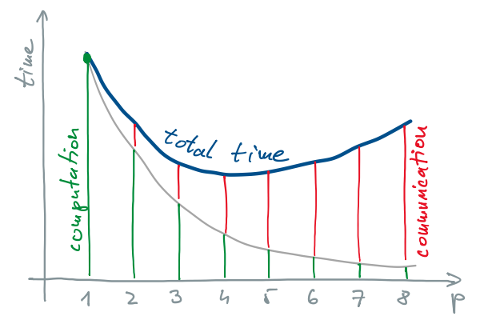
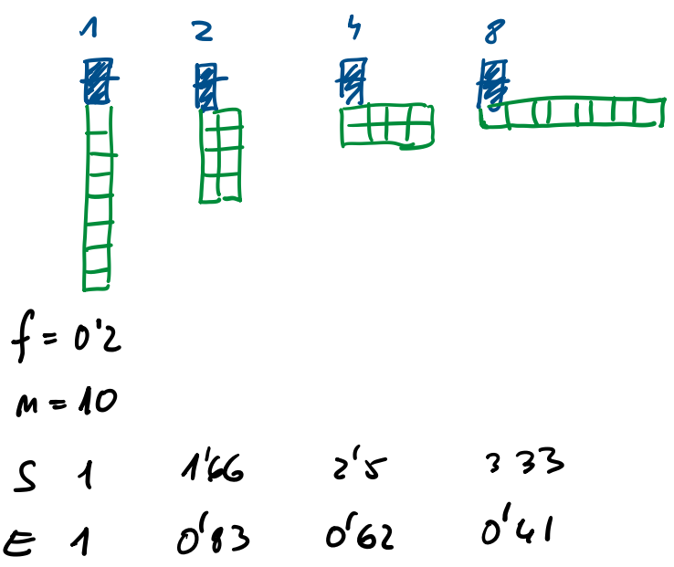
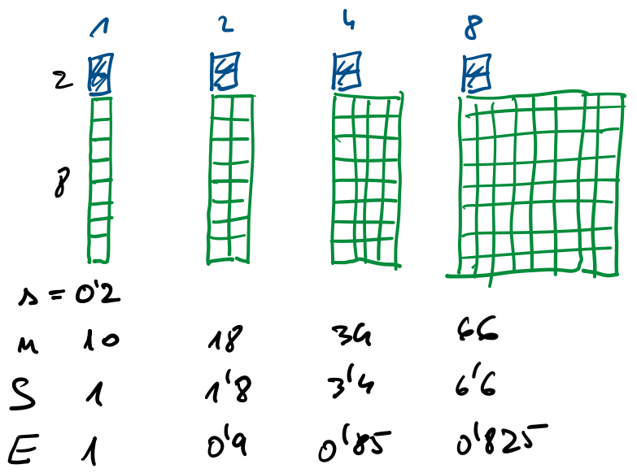
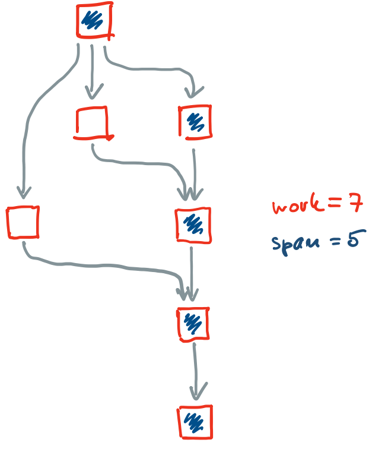
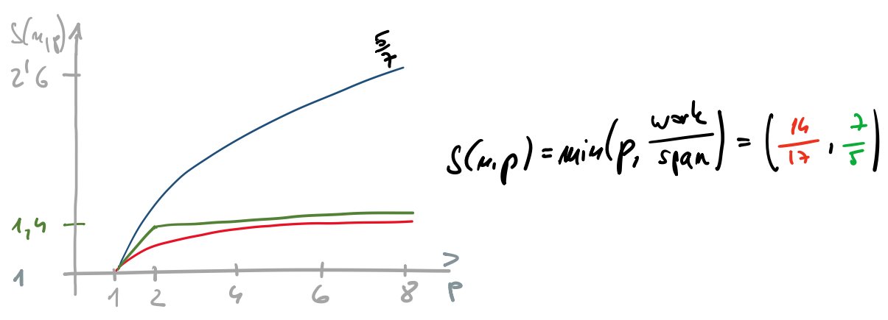
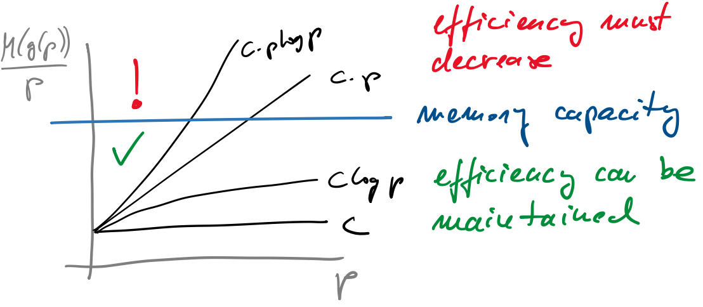

# Performance

- What is performance
  - depends on the use case
  - some measures
    - total time - wall-clock time needed to complete a job
    - throughput - rate at which tasks are completed
    - response time
    - cost
    - efficiency
    - scalability
    - power usage  
    - ...

## Key Features to Performance

- complexities and varieties of architectures
  - data locality and availability of parallel operations
  - per machine tuning can be still necessary
- data locality
  - reuse of nearby locations in time and space
  - important for memory bandwidth and cache usage
    - data chunks that can fit in the cache
    - organize data structures and memory access to reuse data locality
      - access to far memory locations
      - access to locations power of 2 apart (reduce cache conflicts on caches with low associativity)
    - avoid accessing too many pages at ones (TLB misses)
    - align data with cache line boundaries (false sharing)
  - challenge to do for unknown architecture
    - parameter to define granularity (manually or by auto-tuning)
    - cache oblivious approach (locality at all scales)
  - arithmetic intensity
    - ratio computation/data transfer, should be high
    - can be done with fusion and tiling
    - small granularity can bring more data transfer
  - parallel slack
    - extra parallelism available can be beneficial
    - software and hardware schedulers get more flexibility to exploit machine
      - number of tasks equal to number of functional units is tempting, whole system can wait for a certain task interrupted by OS
      - with more parallelism, when problematic task is waiting, another can jump in
      - software does not always support such concepts (POSIX Threads)
        - calling parallel routines from threads can lead to huge numbers of threads
        - OS does not know which threads should run simultaneously

## Measure: Speedup

- definition: $S(n, p) = \frac{t_s(n)}{t_p(n,p)}$
  - $t_s(n)$ - time needed for serial computation
  - $t_p(n,p)$ - time needed for parallel computation
  - $n$ - problem size
  - $p$ - number of workers (tasks, threads)
- parallel program consists of
  - sequential operations, $\sigma(n)$
  - parallel operations, $\varphi(n)$
  - communication, $\kappa(n, p)$

    

- in case of ideal work distribution among workers

  $S(n,p) = \frac{t_s(n)}{t_p(n,p)} = \frac{\sigma(n)+\varphi(n)}{\sigma(n)+\varphi(n)/p + \kappa(n,p)}$

- relative and absolute speedup
  - relative is compared to the serial solution
  - absolute when another (better) algorithm is used

## Measure: Efficiency

- $E(n,p) = \frac{t_s(n)}{p\cdot t_p(n,p)} = \frac{S(n,p)}{p}$
- for ideal work distribution: $E(n,p) = \frac{\sigma(n) + \varphi(n)}{p\sigma(n) + \varphi(n) + p\kappa(n,p)}$
- measures the return of hardware investment by telling how well the hardware is used
- usually $0 \leq E(n,p) \leq 1$
- super-linear speedup with $E(n,p) > 1$
  - most commonly related to better use of cache
  - cooperation between workers can reduce time (earlier stopping)

## Measure: Cost

- $C(n, p) = p \cdot t_p(n) = \frac{p\cdot t_s(n)}{S(n,p)} = \frac{t_s(n)}{E(n,p)}$
- efficient programs contribute to lower computation costs

## Amdahl's Law

- determines speedup based on the portion of serial operations, $f=\frac{\sigma(n)}{\sigma(n) + \varphi(n)}$
- neglects communication
- speedup

  $S(n,p) = \frac{\sigma(n) + \varphi(n)}{\sigma(n) + \varphi(n)/p + \kappa(n,p)} \leq \frac{\sigma(n) + \varphi(n)}{\sigma(n) + \varphi(n)/p}$

  $S(n,p) \leq \frac{1}{f + (1-f)/p}$

- maximal speedup depends on the portion code, which cannot be parallelized
- assumptions
  - constant problem size
  - focus of parallelization is to reduce the total time
- example: $n=10$, $\sigma(n) = 2$, $\varphi(n) = 8$, $f=0.2$, $p=1, 2, 4, 8$
  
  

## Gustafson-Barsis’s Law

- speedup should be measured by scaling the problem to the number of workers, not by fixing the problem size
- applications scale to exploit better and better computers
- portion of sequential tasks in parallel computation, $s = \frac{\sigma(n)}{\sigma(n)+\varphi(n)/p}$
- speedup

  $S(n, p) \leq p - s(p-1)$

- example: $n=10$, $\sigma(n) = 2$, $\varphi(n) = 8$, $f=0.2$, $p=1, 2, 4, 8$

  

## Work-span Model

- optimistic assumptions in previous speedup computation
  - all work that can be parallelized cannot be ideally parallelized
- tasks presented as direct acyclic graph

  

  - ignores communication and memory access
  - assumes greedy scheduling
    - work is computation time of serial machine, $t_1(n) = t_s(n)$
    - span is computation time on ideal parallel machine, $t_{\infty} = t_p(n, \infty)$
      - also named critical path, step complexity, depth
  - work-span model assumes that units of work are of the same time complexity
- lower execution time limit
  - work law: $t_p(n,p) \geq \frac{t_1(n)}{p}$
  - span law: $t_p(n,p) \geq t_{\infty}(n)$
  - combined:

    $t_p(n,p) \geq \max(\frac{t_1(n)}{p}, t_{\infty}(n))$

- upper execution time limit follows Brent's theorem
  - problem can be ideally distributed to $q$ processors, but we have $p \leq q$
  - some processors do additional work: $t_p(n,p) \leq t_p(n,q) + \frac{t_1(n)-t_p(n,q)}{p}$
  - simplifications
    - omit the second term, $\frac{t_p(n,q)}{p}$
    - with ideal machine $q=\infty$
  - lower execution time limit:

    $t_p(n, p) \leq t_{\infty}(n) + \frac{t_1(n)}{p}$

- work-span limits on execution time:

  $t_{\infty}(n) + \frac{t_1(n)}{p} \geq t_p(n,p) \geq \max\left(\frac{t_1(n)}{p}, t_{\infty}(n)\right)$

- work-span limits on speedup:

  $\frac{1}{\frac{t_{\infty}(n)}{t_1(n)} + \frac{1}{p}} \leq S(n,p) \leq \min\left(p, \frac{t_1(n)}{t_{\infty}(n)}\right)$

- example: 7 units of work, execution follows direct-acyclic graph above

   

  - red: upper limit
  - yellow: lower limit
  - blue: Amdahl, $f=\frac{2}{7}$ (all but first and last task can be executed in parallel)
 

## Parallel slack

- $PS = \frac{S(n,\infty)}{p} = \frac{t_s(n)}{p\cdot t_p(n, \infty)}$
- $PS = 8$ works well in practice

## Scalability (iso-efficiency)

- speedup grows with problem size
- efficiency on more workers can be maintained by increasing the problem size
  
  $S(n,p) \leq \frac{\sigma(n) + \varphi(n)}{\sigma(n) + \varphi(n)/p + \kappa(n,p)}$

- total cost of parallelism

  $S(n,p) \leq \frac{p(\sigma(n) + \varphi(n))}{\sigma(n) + \varphi(n) + (p-1)\sigma(n) + p\kappa(n,p)}$
  
- communication overhead, $T_{\mathrm{oh}} = (p-1)\sigma(n) + p\kappa(n,p)$
- efficiency should be maintained

  $E(n,p) = \frac{S(n,p)}{p} \leq \frac{T_s(n)}{T_s(n) + T_{\mathrm{oh}}(n,p)} = \frac{1}{1 + \frac{T_{\mathrm{oh}}(n,p)}{T_s(n)}}$

- serial execution time expressed from the above equation gives

  $T_s(n) \geq \frac{E(n,p)}{1 - E(n,p)} T_{\mathrm{oh}}(n,p) = CT_{\mathrm{oh}}(n,p)$

- to maintain good scalability, efficiency should be constant
  - $T_{\mathrm{oh}}$ increases with $p$
  - inequality can only be satisfied by increasing problem size $n$

- scalability function (iso-effciency)
  - suppose the form relation gives $n \geq g(p)$
  - with large problem sizes memory becomes a bottleneck
  - memory requirements are given by function $M(n)$
  - to maintain efficiency, memory requirements per worker are expressed by the scalability function
  
    $\frac{M(g(p)}{p}$

  - iso-efficiency and memory constraints

   

- example: reduce with tiling
  - use serial algorithm where possible
  - do tree-like reduction to reduce communication costs
  - process
    - break the work to tiles
    - operate on tiles separately
    - combine partial results from tiles
  - serial and tree algorithms
    - use the same number of reduce function applications
    - serial algorithm requires less storage for intermediate results
  - serial reduction of $n$ operands
    - $n-1$ reduce function applications
    - each invocation of reduce function costs $\chi$
    - total execution time equals $t_s(n) = \chi(n-1)$
  - parallel reduction of $n=2^k$ operands
    - communication costs $\lambda$
    - $n/2$ reductions in the first stage can go in parallel, $n/4$ reductions in the second stage can go in parallel, ...
    - in te last stage only one reduction remains
    - altogether we have $\log_2 n$ stages with $n-1$ reductions
    - total execution time equals $t_p(n) = (\chi+\lambda)\log_2 n$
  - parallel reduction of $n=2^k+r$ operands
    - additional stage with $r$ reductions at the very beginning to come to the previous scheme
    - total execution time equals $t_p(n) = (\chi+\lambda)\lceil\log_2 n\rceil$
  - tiled parallel reduction using $p$ tasks
  
    

    - each task performs $\lceil n/p \rceil -1$ sequential reduce operations
    - intermediate results are reduced by three-like scheme in $\lceil\log_2 p\rceil$ steps
    - total execution time equals $t_p(n,p) = \chi\left(\left\lceil \frac{n}{p} \right\rceil - 1\right) + (\chi + \lambda)\lceil \log_2 p \rceil$
  - scalability
    - overhead: $t_{\mathrm{oh}}(n,p) = (p-1)\sigma(n) + p\kappa(n,p)$
      - $\sigma=0$ (all tasks can run in parallel)
      - $\kappa(n,p) = \lambda\lceil\log_2 p\rceil$
    - iso-efficiency condition
      $t_s(n) \geq Ct_{\mathrm{oh}}(n,p) \Rightarrow \chi(n-1) \geq Cp\lambda\lceil\log_2 p\rceil$ for reduction becomes
      $n \geq C'p\log_2 p$ with $g(p) = C'p\log_2 p$
    - reduction memory requirements increase linearly with the number of elements: $M(n) = E n$
    - scalability function for reduction thus becomes

      $\frac{M(n)}{p} \geq \frac{M(g(p))}{p} = \frac{EC'p\log_2 p}{p} = C''\log_2 p$

      - reduction is not ideally scalable
      - suppose that the number of workers and number of operands are doubled
        - quantity of work per processors remains equal, $\chi\left(\left\lceil\frac{2n}{2p}\right\rceil - 1\right) = \chi\left(\left\lceil\frac{n}{p}\right\rceil - 1\right)$
        - one additional reduction step is required, $(\chi + \lambda)\lceil\log_2 2p\rceil = (\chi + \lambda)(\lceil\log_2 p\rceil + 1)$
      - when doubling number of workers ($p_2=2p_1$), doubling number of operands ($n_2 = 2 n_1$) is not enough - to satisfy relations $n_1=C''p_1\log_2 p_1$ and $n_2=C''p_2\log_2 p_2$, we should more than double operands, $n_2 = 2n_1 + 2C''p_1$
